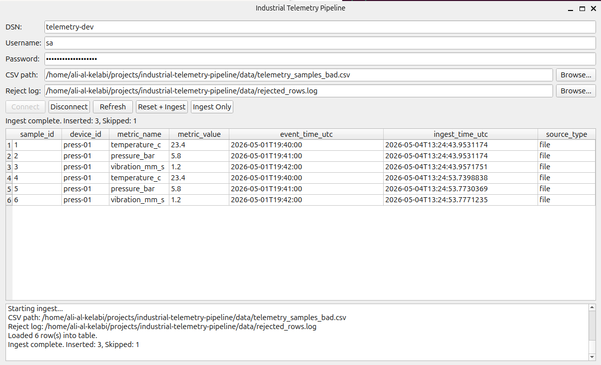

# Industrial Telemetry Pipeline

<p align="center">
  
</p>

A C++/Qt desktop application for ingesting industrial telemetry CSV data into Microsoft SQL Server through ODBC, with input validation, refreshable database views, and reject-log handling for malformed records.

## Overview

This project demonstrates a production-style telemetry ingestion workflow built as a desktop GUI application. It allows an operator to connect to a SQL Server database, load telemetry records from CSV files, refresh persisted data from the database, reset and reseed the target table, and capture invalid rows in a reject log instead of failing the entire ingestion run.

The project combines desktop software engineering, database integration, and data-ingestion robustness in one practical application.

## Features

- Qt Widgets desktop GUI
- ODBC-based connection to Microsoft SQL Server
- Connect / Disconnect workflow
- Refresh button to reload persisted database state
- Reset + Ingest workflow to clear and reseed the telemetry table
- Ingest Only workflow to append rows
- Input validation for CSV and reject-log paths
- Sortable table view after load
- Operational log panel for status feedback
- Reject-log support for malformed CSV rows

## Workflow

1. Launch the application.
2. Enter DSN, username, password, CSV path, and reject-log path.
3. Click **Connect** to open the SQL Server connection and load persisted rows.
4. Click **Refresh** to reload the current database contents.
5. Click **Reset + Ingest** to clear the telemetry table and load a CSV from scratch.
6. Click **Ingest Only** to append rows without deleting existing data.
7. Review invalid rows in the reject log if malformed input is detected.

## Validation and error handling

Implemented validation includes:
- missing CSV file detection
- reject-log path validation
- database connection checks before ingest actions
- malformed numeric field detection
- reject logging for invalid rows

Example invalid-row behavior:
- invalid `metric_value` rows are skipped
- valid rows are still inserted
- the reject log stores the line number, reason, and original row

## Tech stack

- **Language:** C++
- **GUI:** Qt Widgets
- **Database connectivity:** ODBC
- **Database:** Microsoft SQL Server
- **Build system:** CMake
- **Environment:** Linux / Ubuntu

## Project structure

```text
industrial-telemetry-pipeline/
├── src/                # Application source files
├── data/               # Sample CSV files and local runtime data
├── build/              # Local build output (excluded from Git)
├── README.md
└── .gitignore
```

## Build

### Requirements

- C++ compiler with C++17 support
- CMake
- Qt development libraries
- ODBC development libraries
- Configured SQL Server DSN

### Commands

```bash
mkdir -p build
cd build
cmake ../src
make -j$(nproc)
./telemetry_app
```

## Test scenarios

### Happy path
- Connect to SQL Server
- Load existing telemetry rows
- Run **Reset + Ingest** with a valid CSV
- Verify that rows are inserted and displayed
- Run **Ingest Only** and verify that rows are appended

### Bad-row validation
- Add an intentionally malformed CSV row such as an invalid numeric `metric_value`
- Run **Reset + Ingest**
- Verify that valid rows are inserted, invalid rows are skipped, and the reject log captures the failure reason

## Skills demonstrated

- C++ desktop application development
- Qt GUI design and event-driven programming
- SQL Server integration from native applications
- ODBC connection management
- CSV parsing and validation
- Robust error handling and operator feedback
- Data-ingestion workflow design
- Demo-ready application testing

## Future improvements

- background worker thread for long-running ingestion jobs
- progress bar for large CSV files
- export of filtered table views
- packaged deployment
- unit and integration tests

## Notes

This repository excludes local build artifacts, runtime logs, and sensitive environment-specific configuration. Create your own local DSN and environment settings before running the project.
